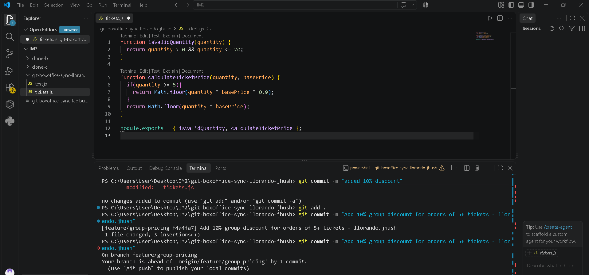
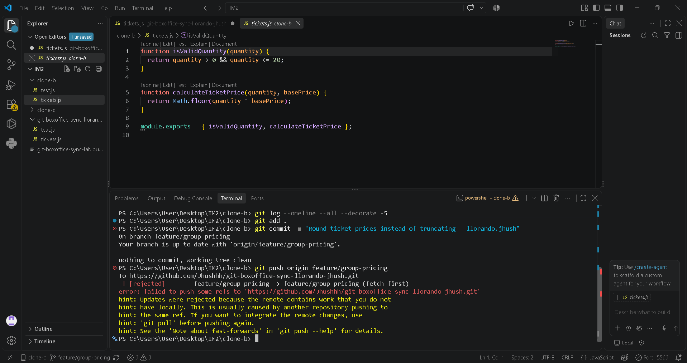
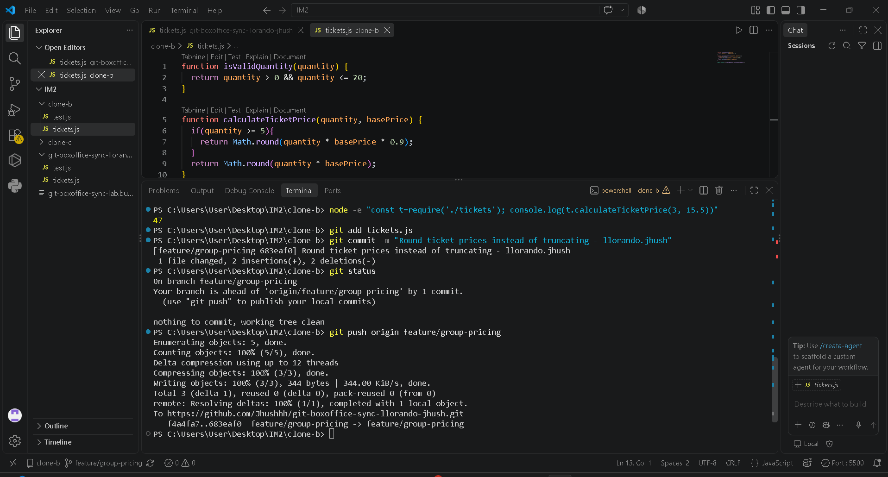
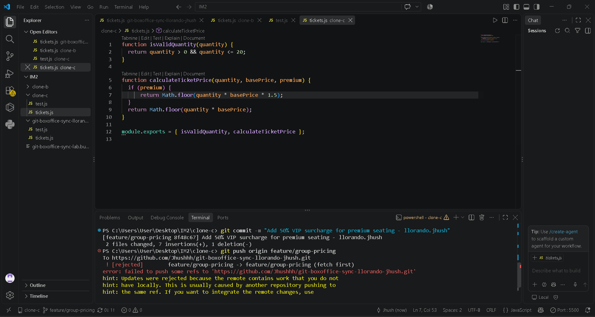
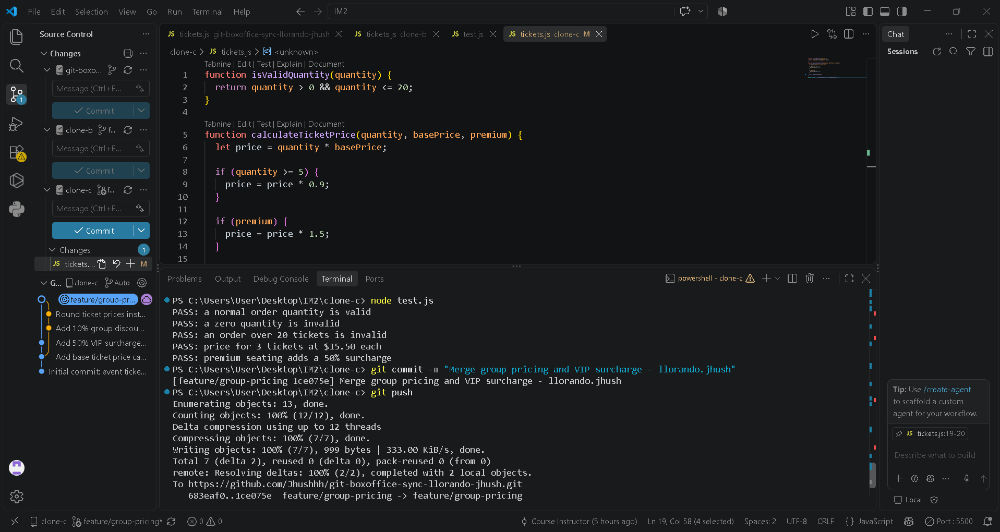
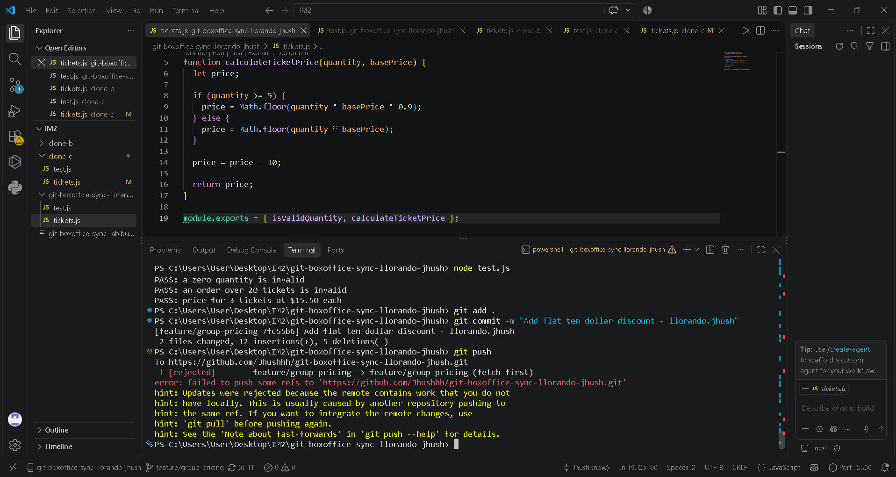

# Git Box Office Sync Workflow
Task 1 – Group Pricing

The group-pricing change added a 10% discount for orders of 5 or more tickets.

Task 2 – Rounding Conflict

The rounding change replaced Math.floor() with Math.round(). The push was rejected because Clone B had not yet synchronized with the changes from Clone A.

Task 3 – Two-Way Merge

The conflict was resolved by keeping both the 10% group discount and the new rounding behavior.

Task 4 – VIP Surcharge

The VIP change added a 50% surcharge for premium seating. The push was rejected because Clone C was behind the remote branch.

Task 5 – Three-Way Merge

The three-way conflict was more difficult because a third line of work had changed the same shared function. The final code kept the group discount, rounding, and VIP surcharge.

Task 6 – Flat $10 Discount and Rebase

The flat $10 discount was added to the shared pricing function. The initial push was rejected because Clone A was behind the remote branch. I then fetched the latest changes, rebased my work, resolved conflicts in more than one file, ran the tests, and pushed without force.

Task 7 – Final Merge and Tag

The feature branch was finally merged into main, and the updated main branch was pushed to GitHub. The final commit was tagged as v1.0-synced and the tag was pushed to GitHub.

## 1. Final `calculateTicketPrice` Function

The final function combines all the contributors' changes.

* Group pricing contributor (Clone A): Added the 10% discount when buying 5 or more tickets.
* Rounding contributor (Clone B): Changed the calculation from `Math.floor()` to `Math.round()`.
* VIP contributor (Clone C):Added the `premium` parameter and a 50% surcharge for premium seating.
* Flat discount contributor (Clone A – Task 6): Added the $10 discount after the other price calculations.

The final function applies the group discount, VIP surcharge, $10 discount, and then rounds the final price.

## 2. Task 3 vs. Task 5 Conflicts

Task 3 was a two-way conflict because there were only two different versions of the same code to combine. Task 5 was harder because a third line of work had also changed the code, so I had to consider more changes and make sure the group discount, rounding, and VIP surcharge all worked together without removing another contributor's work.

## 3. Why Task 6 Affected Other Tests

The flat $10 discount was added to the shared `calculateTicketPrice` function, so it affected every calculation that used that function, including the group-discount and VIP tests. This shows that changes in shared code are not completely isolated because one change can affect the results of features created by other contributors.

## 4. Process Change That Could Prevent the Rejected Pushes

The team could use **`git pull` or `git fetch` and synchronize with the remote branch before starting work and pushing changes**. This would let each contributor see the latest changes and handle conflicts locally before trying to push, preventing the three rejected pushes.
